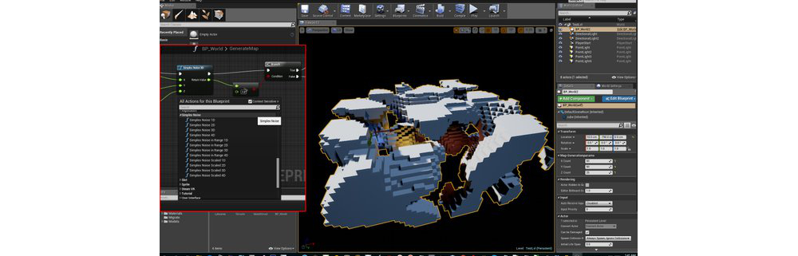

# SimplexNoise




* This is a clean, fast, modern and free Perlin Simplex noise function.
* If we change float to double it could be even faster but there is no double type in Blueprint
* All Public Functions are BlueprintCallable so they can be used in every blueprint

From DevDad and Dedicated to you and Unreal Community.
Code is now under MIT License, Use it free for what ever you want.
I only request that you mention me in the credits for your game in the way that feels most appropriate to you.

* SimplexNoise 1D,2D,3D & 4D
* Scaled Version SimplexNoise 1D,2D,3D & 4D
* InRange version SimplexNoise 1D,2D,3D & 4D
* SimplexNoise Function retruns float value between 0 - 1
* SimplexNoise Scaled retruns float value between 0 - scale factor 
* SimplexNoise In Range returns float value between minRange - maxRange
* inFactor value added to all functions to set frequency of the noise [ Recomended values form: 0.1 - 0.00001 ]
* GetSimpleNoise1D_EX (float x, float lacunarity, float persistance, int octaves, float inFactor, bool ZeroToOne)
* GetSimpleNoise2D_EX (float x, float y, float lacunarity, float persistance, int octaves, float inFactor, bool ZeroToOne)
* GetSimpleNoise3D_EX (float x, float y, float z, float lacunarity, float persistance, int octaves, float inFactor, bool ZeroToOne)
* GetSimpleNoise4D_EX (float x, float y, float z, float w, float lacunarity, float persistance, int octaves, float inFactor, bool ZeroToOne)

This algorithm was originally designed by Ken Perlin, but my code has been
adapted and extended from the implementation written by Stefan Gustavson (stegu@itn.liu.se)
and modified to fit to Unreal Engine 4

Unreal Engine 5 (UE5)

This Git Hub Forked Repository has been updated in the SimplexNoise.uplugin for UE5 In the source code to get this built with Visual Studio 2022. 
You will need to git clone outside the Engine Source build C:\User\Owner\source\repos is the root for UE5

and where "Owner" is your directory obtined from the Windows 10 system variable %USERPROFILE%

Download Git Bash/Git CMD from https://git-scm.com/download/win for Windows 10.

Open Git CMD

Text copy and paste and Execute each of these commands

There is a file simplexsetup.bat which contains the same commands
```

REM GIT root for REPOSITORIES for extra drive e.g D:\source\repos\

set GITREPO=%USERPROFILE%\source\repos

REM Set the UE5 Source path name below
 
set UE5REPO=%GITREPO%\ue5

dir %UE5REPO%

REM set SimplexNoise path below using one level up from UE5REPO

set SN=%GITREPO%\ArtAndCodeSuite

REM rmdir/s %UE5REPO%\Engine\Plugins\ArtAndCodeSuite

REM rmdir/s %SN%

mkdir %SN%

mkdir %UE5REPO%\Engine\Plugins\ArtAndCodeSuite\SimplexNoise

cd %SN%

git clone https://github.com/jimshalo10/SimplexNoise.git

rem stay in Git-cmd and copy the SimplexNoise.uplugin into UE5 plugins

REM go back to original path
REM cd %USERPROFILE%

copy %SN%\SimplexNoise\SimplexNoise.uplugin %UE5REPO%\Engine\Plugins\ArtAndCodeSuite\SimplexNoise\SimplexNoise.uplugin 
```

